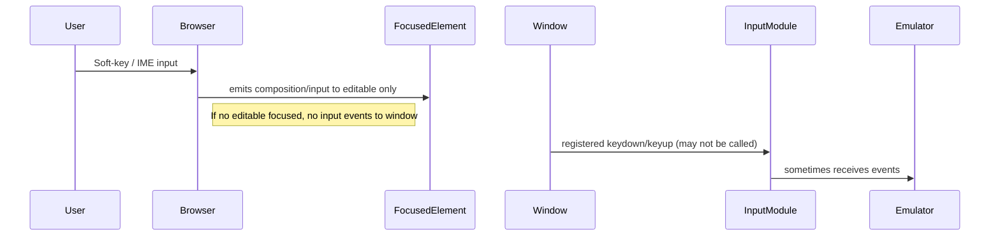

# feature-improve-interaction-with-canvas-emulation

Date: 2026-02-03

Branch to create

- feature-improve-interaction-with-canvas-emulation

Short summary

This change improves keyboard/IME/virtual-keyboard reliability for the emulator by:

- Making the emulator canvas focusable in HTML (tabindex=0) to reduce focus races.
- Adding a hidden off-screen text input that captures mobile IME composition/input events and dispatches synthesized key events and mapped emulator key presses.
- Updating the virtual on-screen keyboard behavior so pointerdown focuses the hidden input (preventScroll: true) and pointerup blurs it (to hide mobile keyboard), preventing the soft keyboard from sticking open.
- Dispatching optional synthetic KeyboardEvent('keydown'/'keyup') from the hidden input handler to preserve compatibility with existing keydown/keyup handlers.

Root cause

- Mobile IMEs and on-screen keyboards often do not emit keydown/keyup events to window/document when no editable element is focused. The original implementation relied on keydown/keyup on window/document/canvas and attempted to focus the canvas programmatically after virtual key presses — many mobile platforms do not route IME text via those events. As a result, input from virtual/soft keyboards and IMEs may have been dropped.
- Virtual keyboard pointer handlers previously focused the canvas; this may not enable IME behavior and can cause the soft keyboard to remain visible or not appear at all. Additionally, focusing the canvas does not capture composition/input events.

Proposed minimal changes (summary)

0. Create a new branch off main called feature-improve-interaction-with-canvas-emulation (include this md in this branch)

1) index.html

- Add tabindex="0" to the canvas element so it is focusable by default and accessible.

2) src/input.mjs

- Add code to create and manage a hidden input element (id: __emu_hidden_input) appended to document.body, positioned off-screen.
- Bind input/composition event handlers to the hidden input to map characters to emulator key presses and dispatch synthetic KeyboardEvent events.
- Update createVirtualKeyboard() pointer handlers:
  - pointerdown: pressKey(key); this._ensureHiddenInput()?.focus({ preventScroll: true });
  - pointerup: releaseKey(key); this._ensureHiddenInput()?.blur();
  - pointerleave: releaseKey(key); this._ensureHiddenInput()?.blur();
- Ensure hidden input focus handler constrains selection to 0 to avoid scroll/growth.

3) Tests

- Add a unit test that verifies virtual keyboard button pointerdown/pointerup updates Input matrix and triggers release.

Adjusted behaviors (per user request)

- Do NOT permanently leave the hidden input focused after virtual key press. Implement blur() on pointerup / touchend (immediate blur acceptable).
- Keep hidden input focused during press to allow IME/soft-keyboard input when user intends to type multiple characters.
- Add a focus listener to set selection range to 0 (prevent input growth/scroll).
- Optionally dispatch synthetic KeyboardEvent events to the window so existing keydown/keyup logic runs unchanged.

Exact diffs (ready-to-apply)

- index.html (one-line change)

```html
<!-- language: html -->
-<canvas id="screen" width="320" height="240" aria-label="ZX Spectrum screen"></canvas>
+<canvas id="screen" tabindex="0" width="320" height="240" aria-label="ZX Spectrum screen"></canvas>
```

- src/input.mjs (insertions described; simplified unified patch below)

```diff
*** language: diff
*** Update File: src/input.mjs
@@
-    // Optionally created overlay element
-    this.overlay = null;
+    // Optionally created overlay element
+    this.overlay = null;
+
+    // Hidden text input to capture IME / mobile soft-keyboard events
+    this._hiddenInput = null;
+    this._onHiddenInput = null;
+    this._onCompositionStart = null;
+    this._onCompositionEnd = null;
@@
-    try {
-      const canvas = (typeof document !== 'undefined') ? document.getElementById('screen') : null;
-      if (canvas) {
-        canvas.addEventListener('keydown', this._keydown, { passive: false, capture: true });
-        canvas.addEventListener('keyup', this._keyup, { passive: false, capture: true });
-        try { if (typeof window !== 'undefined' && window.__TEST__) window.__TEST__.inputListeners = window.__TEST__.inputListeners || {}; window.__TEST__.inputListeners.canvas = true; } catch(e){}
-      }
-    } catch (e) { /* ignore */ }
+    try {
+      const canvas = (typeof document !== 'undefined') ? document.getElementById('screen') : null;
+      if (canvas) {
+        canvas.addEventListener('keydown', this._keydown, { passive: false, capture: true });
+        canvas.addEventListener('keyup', this._keyup, { passive: false, capture: true });
+        try { if (typeof window !== 'undefined' && window.__TEST__) window.__TEST__.inputListeners = window.__TEST__.inputListeners || {}; window.__TEST__.inputListeners.canvas = true; } catch(e){}
+      }
+    } catch (e) { /* ignore */ }
+
+    // Ensure hidden input exists to capture IME and soft-keyboard input events (best-effort)
+    try { this._ensureHiddenInput(); } catch (e) { /* ignore */ }
@@
+  _ensureHiddenInput() {
+    if (this._hiddenInput) return this._hiddenInput;
+    try {
+      const inp = document.createElement('input');
+      inp.type = 'text';
+      inp.id = '__emu_hidden_input';
+      inp.autocapitalize = 'none';
+      inp.autocomplete = 'off';
+      inp.spellcheck = false;
+      inp.style.cssText = 'position:fixed;left:-9999px;top:0;width:1px;height:1px;opacity:0;pointer-events:none;';
+      inp.addEventListener('focus', () => { try { inp.selectionStart = inp.selectionEnd = 0; inp.setSelectionRange(0,0); } catch(e){} }, { passive: true });
+      document.body.appendChild(inp);
+      this._hiddenInput = inp;
+
+      this._onHiddenInput = (e) => {
+        try {
+          const v = inp.value || '';
+          const last = v.length ? v[v.length - 1] : '';
+          if (last) {
+            const keyName = ('' + last).toLowerCase();
+            if (KEY_TO_POS.has(keyName)) {
+              this.pressKey(keyName);
+              setTimeout(() => this.releaseKey(keyName), 60);
+            } else if (last === ' ') {
+              this.pressKey('space'); setTimeout(() => this.releaseKey('space'), 60);
+            }
+
+            // synthetic key events for compatibility
+            try {
+              const code = last.match(/[a-z]/i) ? `Key${last.toUpperCase()}` : ('Digit' + last);
+              window.dispatchEvent(new KeyboardEvent('keydown', { key: last, code: code, bubbles: true }));
+              setTimeout(() => { window.dispatchEvent(new KeyboardEvent('keyup', { key: last, code: code, bubbles: true })); }, 60);
+            } catch (e) { /* ignore */ }
+          }
+        } catch (e) { /* ignore */ } finally { inp.value = ''; }
+      };
+
+      this._onCompositionStart = () => {};
+      this._onCompositionEnd = (e) => { try { const text = e.data || ''; if (text) { const last = text[text.length-1]; if (last && KEY_TO_POS.has(last.toLowerCase())) { this.pressKey(last.toLowerCase()); setTimeout(()=>this.releaseKey(last.toLowerCase()),60); } } } catch(e){} };
+
+      inp.addEventListener('input', this._onHiddenInput, { passive: true });
+      inp.addEventListener('compositionstart', this._onCompositionStart, { passive: true });
+      inp.addEventListener('compositionend', this._onCompositionEnd, { passive: true });
+    } catch (e) { /* best effort */ }
+    return this._hiddenInput;
+  }
@@
-        btn.addEventListener('pointerdown', (e) => {
-          e.preventDefault();
-          btn.style.background = '#666';
-          this.pressKey(key);
-          // focus canvas so physical keyboard continues to control emulator after virtual press
-          try { const c = document.getElementById('screen'); if (c && typeof c.focus === 'function') c.focus(); } catch (e) { /* ignore */ }
-        });
+        btn.addEventListener('pointerdown', (e) => {
+          // Keep keyboard open during press (good for typing multiple chars)
+          e.preventDefault();
+          btn.style.background = '#666';
+          this.pressKey(key);
+          try { this._ensureHiddenInput()?.focus({ preventScroll: true }); } catch (err) { /* ignore */ }
+        });
@@
-        btn.addEventListener('pointerup', (e) => {
-          e.preventDefault();
-          btn.style.background = '#333';
-          this.releaseKey(key);
-          try { const c = document.getElementById('screen'); if (c && typeof c.focus === 'function') c.focus(); } catch (e) { /* ignore */ }
-        });
+        btn.addEventListener('pointerup', (e) => {
+          e.preventDefault();
+          btn.style.background = '#333';
+          this.releaseKey(key);
+          try { this._ensureHiddenInput()?.blur(); } catch (err) { /* ignore */ }
+        });
@@
-        btn.addEventListener('pointerleave', (e) => {
-          btn.style.background = '#333';
-          this.releaseKey(key);
-          try { const c = document.getElementById('screen'); if (c && typeof c.focus === 'function') c.focus(); } catch (e) { /* ignore */ }
-        });
+        btn.addEventListener('pointerleave', (e) => {
+          btn.style.background = '#333';
+          this.releaseKey(key);
+          try { this._ensureHiddenInput()?.blur(); } catch (e) { /* ignore */ }
+        });
***
```

New test (unit)

```js
// test/virtual-keyboard.test.mjs
import { describe, it, expect, beforeEach, afterEach } from 'vitest';
import Input from '../src/input.mjs';

describe('Virtual keyboard integration (unit)', () => {
  let input;
  beforeEach(() => {
    document.body.innerHTML = '<div id="app"></div>';
    input = new Input();
    input.start();
    input.createVirtualKeyboard('#app');
  });
  afterEach(() => { input.stop(); document.body.innerHTML = ''; });
  it('pressing virtual key button updates matrix and releases', async () => {
    const btn = document.querySelector('.zxvk-overlay button[data-key="q"]');
    expect(btn).toBeTruthy();
    btn.dispatchEvent(new PointerEvent('pointerdown', { bubbles: true }));
    expect(input.isKeyPressed('q')).toBe(true);
    btn.dispatchEvent(new PointerEvent('pointerup', { bubbles: true }));
    expect(input.isKeyPressed('q')).toBe(false);
  });
});
```

Verification steps (local)

1. Create branch:

```bash
git checkout -b feature-improve-interaction-with-canvas-emulation
```

2. Apply the diffs above (manually edit files or use a patch). 3 files: `index.html`, `src/input.mjs`, `test/virtual-keyboard.test.mjs`.
3. Run unit tests:

```bash
npm test
# or
npx vitest
```

4. Open the page in a mobile browser (or simulator) and verify:

- Tap a virtual-key 'Q' on the on-screen keyboard overlay: soft keyboard should briefly appear while pressing and disappear after release.
- window.__ZX_DEBUG__.getKeyboardState() should show the Q key press during the press and not after release.
- On desktop, physical keyboard should continue to work unchanged.

Risk / impact

- Risk: Low–medium. Changes are additive and confined to input handling and UI overlay. Hidden input is off-screen and event handlers are best-effort; no change to emulator I/O logic (getPortValue) or ULA.
- Potential UX impact: Slight change in focus behavior; blur() on pointerup is essential for mobile UX and will close soft keyboards immediately after virtual button release.

Files to review further

- src/main.mjs — verify there are no duplicate canvas forwarding listeners and that auto-focus logic is compatible with the hidden input.
- src/ula.mjs — ensure _applyInputToULA reception is performant under microtask scheduling.
- tests/e2e/* — consider adding mobile device emulation scenarios.

Sequence diagrams

Current unreliable flow (short):



Proposed reliable flow:

```mermaid
sequenceDiagram
User->>Browser: Soft-key / IME input or virtual overlay tap
Browser->>HiddenInput: hidden input focused; composition/input delivered
HiddenInput->>InputModule: input/composition -> map and pressKey/releaseKey
InputModule->>Emulator: _applyInputToULA -> emulator keyboard state updated
```

Next steps

- I will wait for confirmation. On approval I will:
  1. create branch locally and apply patches
  2. run unit tests and CI if available
  3. open a browser to smoke test behavior on desktop and mobile emulation

---

This file captures the proposed patch and instructions. To inspect it in the workspace open: [`memory-bank/mprove-interaction-with-canvas-emulation-20260203.md`](memory-bank/mprove-interaction-with-canvas-emulation-20260203.md:1)
